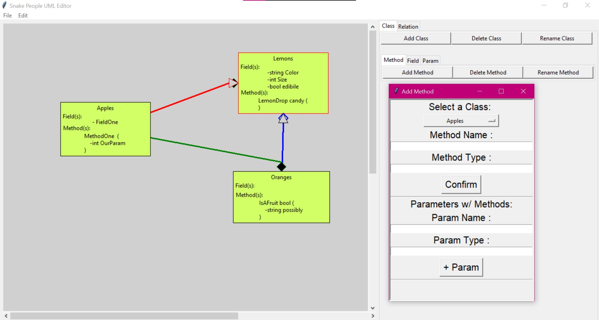
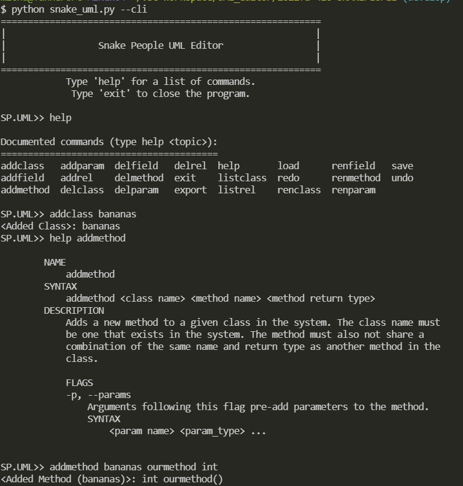

# Snake People (Fall 2021) UML Editor

This program uses a command line or graphical user interface to represent data in a UML diagram. The editor's CLI and GUI support adding, deleting, modifying, and in the GUI's case, displaying UML elements. The ability to save and load along with exporting is available to the user. 

## Prerequisites
1. To run the program, you must install Python (3.9.6 at the time). (https://www.python.org/downloads/)
    * During installation of python, a box can be checked to "Add Python 3.9.x to PATH". Check this box. 
2. Next make sure all necessary libraries are installed so the program functions. They can be installed via the command line by typing in what is below once the repo is      downloaded.
    * `pip install -r requirements.txt`

## How to run:
1. Download the latest version from the [repo] (https://github.com/mucsci-students/2021fa-420-SNAKEPEOPLE).
2. Ensure python version 3.9 or greater is installed on your system.
3. In your terminal, enter the directory where the repo was downloaded to. Navigate to `/2021fa-420-SNAKEPEOPLE/`
4. See the user guide for more details about the program and examples.

  ### To Run in GUI mode
    - Execute the command `python snake_uml.py` with no flags.
    
   #### GUI
   

  ### To Run in CLI mode
    - Execute the command `python snake_uml.py` with the flag`--cli`
    
   #### CLI
   

## Authors
[Nick Bellman](https://github.com/nrbellman) 
[Max Harris](https://github.com/Mharr1) 
[Curtis Kane](https://github.com/curtisjk717) 
[Evan Hanzelman](https://github.com/EHanz) 
[Tanner Michael](https://github.com/TannerMichael) 

